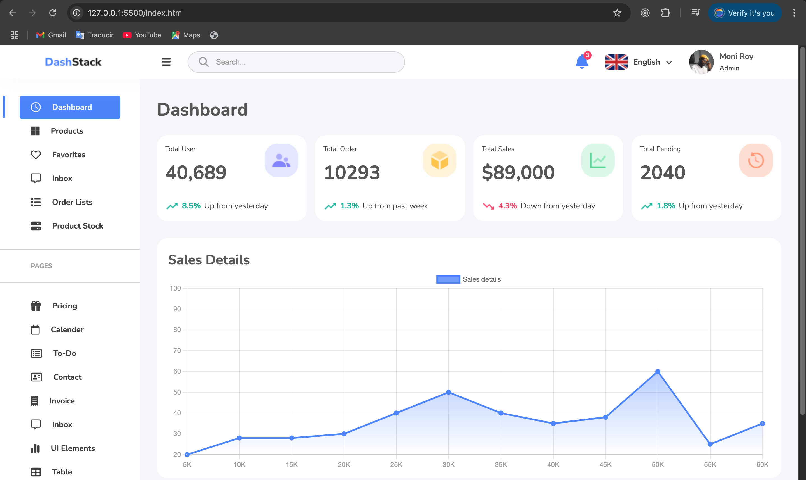
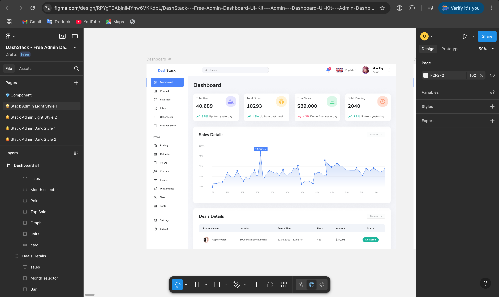

##  🧐 Responsive Dashboard

> This is a page made with HTML and vanilla CSS, we made it responsive.



## 🔧 Built With

- HTML
- Sass (.scss extension)
- Using flexbox and CSS grid
- Using mediaqueris for Responsive Design

## Figma Design



## 🔴 Live Demo

[Demo Link](https://dancing-lebkuchen-c9dc82.netlify.app/)


## 🛠 Getting Started

To get a local copy up and running follow these simple example steps.

- Go to the main page of te repo.
- Press the ```Code``` button and get the repo link.
- Clone it using git.

## ✒️ Authors

👤 **Cecilia Benitez**

- [@Ceci007](https://github.com/Ceci007)


## 🤝 Contributing

Contributions, issues and feature requests are welcome!

Feel free to check the [issues page](https://github.com/Ceci007/css-dashboard/issues).

## 📝 License

This project is [MIT](lic.url) licensed.